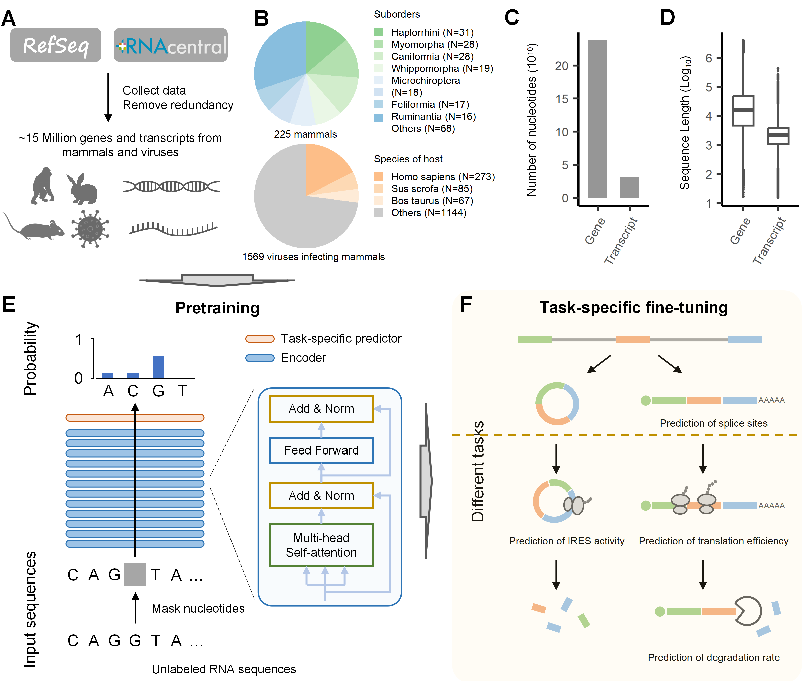

# LAMAR
A Foundation Language Model for Multilayer Regulation of RNA

This repository contains code and pre-trained weights for RNA foundation language model **LAMAR**. LAMAR outperformed benchmark models in various RNA regulation tasks, helping to decipher the regulation rules of RNA.  

La Morena was developed by Rnasys Lab and Bio-Med Big Data Center, Shanghai Institute of Nutrition and Health (SINH), Chinese Academy of Sciences (CAS).  


## Citation

## Environment
The pretraining was conducted on A800 80GB graphic process units, and the fine-tuning was conducted on the Sugon Z-100 16GB and Tesla V100 32GB clusters of graphic process units.  
The environments are a little different on different devices. **The unified environment will be developed.**   
Pretraining environment:   
    A800: environment_A800_pretrain.yml  
Fine-tuning environment:   
    Sugon Z-100: environment_Z100_finetune.yml  
    V100(ppc64le): environment_V100_finetune.yml

### Required packages
accelerate >= 0.26.1  
torch >= 1.13  
transformers >= 4.32.1  
datasets >= 2.12.0  
pandas >= 2.0.3  
safetensors >= 0.4.1  

## Usage

### Compute embeddings
```python
from LaMorena.modeling_nucESM2 import EsmModel
from transformers import AutoConfig, AutoTokenizer


seq = "ATACGATGCTAGCTAGTGACTAGCTGATCGTAGCTG"
device = torch.device("cuda:0")
# instance tokenizer and config
tokenizer = AutoTokenizer.from_pretrained("tokenizer/single_nucleotide/", model_max_length=model_max_length)
config = AutoConfig.from_pretrained(
    "config/config_150M.json", vocab_size=len(tokenizer), pad_token_id=tokenizer.pad_token_id, mask_token_id=tokenizer.mask_token_id, token_dropout=False, positional_embedding_type='rotary', 
    hidden_size=768, intermediate_size=3072, num_attention_heads=12, num_hidden_layers=12
)
# intance the model and load pretrained weights
model = EsmModel(config)
weights = load_file('pretrain/saving_model/mammalian80D_4096len1mer1sw_80M/checkpoint-250000/model.safetensors')
weights_dict = {}
for k, v in weights.items():
    new_k = k.replace('esm.', '') if 'esm' in k else k
    weights_dict[new_k] = v
model.load_state_dict(weights_dict, strict=False)
model = model.to(device)
# Compute embeddings
model.eval()
with torch.no_grad():
    inputs = tokenizer(seq, return_tensors="pt")
    input_ids = inputs['input_ids'].to(device)
    attention_mask = inputs['attention_mask'].to(device)
    outputs = model(
        input_ids=input_ids, 
        attention_mask=attention_mask
    )
    embedding = outputs.last_hidden_state[0, 1 : -1, :]
```
The paths of scripts:   
    Compute embeddings of nucleotides: src/embedding/NucleotideEmbeddingMultipleTimes.ipynb  
    Compute embeddings of functional elements: src/embedding/FunctionalElementEmbedding.ipynb  
    Compute embeddings of transcripts: src/embedding/RNAEmbedding.ipynb  
    Compute embeddings of splice sites: src/embedding/SpliceSiteEmbedding.ipynb  

### Predict splice sites from pre-mRNA sequences

### Predict the translation efficiency of mRNAs based on 5' UTRs (HEK293 cell line)
The paths of scripts:   
  Fine-tune: src/UTR5TEPred/Timothy/finetune/finetune.ipynb  
  Evaluate: src/UTR5TEPred/Timothy/finetune/evaluate.ipynb

### Predict the half-time of mRNAs based on 3' UTRs (cell line)
